# Documentación de Arquitectura — VIAD HUB

**Clínicas de Entrenamiento de IA — Consorcio Educativo de Oriente (CEO)**

| Campo | Valor |
|---|---|
| Fecha | 9 de marzo de 2026 |
| Versión | 1.0 |
| Autor | José Ángel Balbuena Palma |
| Estado | Producción |

---

## Tabla de Contenidos

1. [Visión General del Sistema](#1-visión-general-del-sistema)
2. [Arquitectura de Alto Nivel](#2-arquitectura-de-alto-nivel)
3. [Frontend — ceo_ia_hub](#3-frontend--ceo_ia_hub)
4. [Backend — agente_viad_hub](#4-backend--agente_viad_hub)
5. [Base de Datos — Supabase](#5-base-de-datos--supabase)
6. [Flujo del Agente IA (LangGraph)](#6-flujo-del-agente-ia-langgraph)
7. [Pipeline RAG (Retrieval-Augmented Generation)](#7-pipeline-rag-retrieval-augmented-generation)
8. [Flujo de Autenticación y Autorización](#8-flujo-de-autenticación-y-autorización)
9. [Streaming SSE (Server-Sent Events)](#9-streaming-sse-server-sent-events)
10. [Estructura de Archivos](#10-estructura-de-archivos)
11. [Rutas y Endpoints de la API](#11-rutas-y-endpoints-de-la-api)
12. [Modelo de Datos](#12-modelo-de-datos)
13. [Despliegue e Infraestructura](#13-despliegue-e-infraestructura)
14. [Variables de Entorno](#14-variables-de-entorno)
15. [Stack Tecnológico](#15-stack-tecnológico)
16. [Restricciones Técnicas](#16-restricciones-técnicas)

---

## 1. Visión General del Sistema

**VIAD HUB** es una plataforma interna de entrenamiento en Inteligencia Artificial para el Consorcio Educativo de Oriente (CEO). Permite a los colaboradores del consorcio:

- Consultar una **biblioteca de prompts** categorizados para distintas herramientas de IA
- Acceder a un **catálogo de micro-aprendizaje en video**
- Interactuar con **VIAD Bot**, un chatbot conversacional con capacidades de búsqueda semántica (RAG)
- Administrar contenido desde un **panel de administración** protegido

### Componentes Principales

| Componente | Tecnología | Despliegue | URL Producción |
|---|---|---|---|
| Frontend | Next.js 16 + React 19 | Vercel | https://ceo-ia-hub-tu7s.vercel.app |
| Backend (Agente IA) | FastAPI + LangGraph | Railway | https://web-production-ccc6a.up.railway.app |
| Base de Datos | PostgreSQL + pgvector | Supabase | (Proyecto Supabase) |
| Autenticación | Supabase Auth | Supabase | (Integrado) |

---

## 2. Arquitectura de Alto Nivel

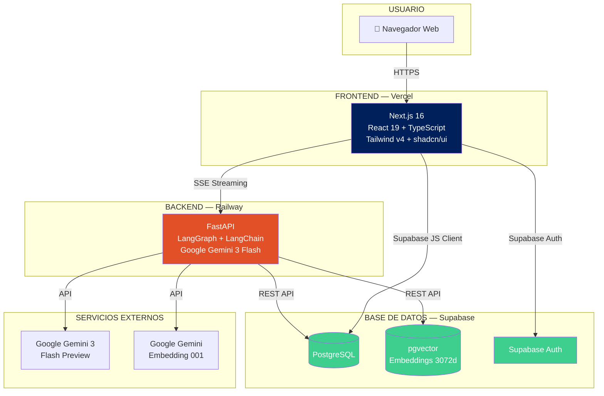

### Diagrama de Comunicación entre Componentes

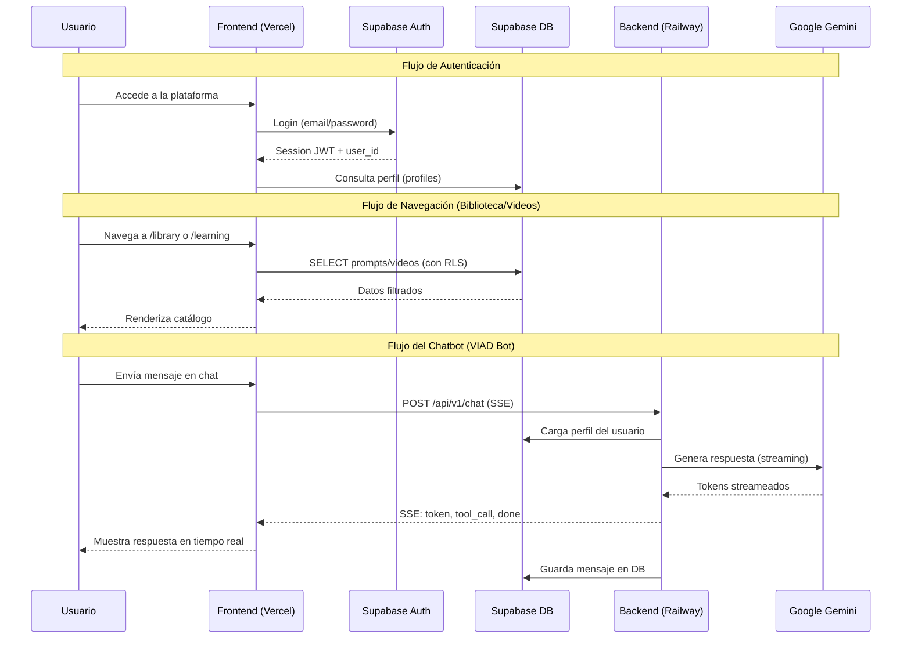

---

## 3. Frontend — ceo_ia_hub

### Stack del Frontend

| Capa | Tecnología |
|---|---|
| Framework | Next.js 16 (App Router) |
| UI Library | React 19 |
| Lenguaje | TypeScript (modo estricto) |
| Estilos | Tailwind CSS v4 |
| Componentes UI | shadcn/ui (estilo new-york) |
| Iconos | lucide-react |
| Notificaciones | sonner (toast) |
| Base de datos | Supabase JS Client |
| Autenticación | Supabase Auth |

### Identidad Visual

```
Colores de Marca:
┌─────────────────────────────────────────────┐
│  viad-navy    #00205c  ████  (Primario)     │
│  viad-blue    #94c9ed  ████  (Secundario)   │
│  viad-orange  #e25027  ████  (Acento)       │
│  viad-purple  #87497a  ████  (Acento)       │
│  viad-salmon  #f4c0b5  ████  (Acento)       │
│  viad-lavender #c0b0d7 ████  (Acento)       │
└─────────────────────────────────────────────┘

Tipografías:
  - Monda (cuerpo de texto, local TTF)
  - Nexa Family (títulos, local OTF)
  - JetBrains Mono (código, Google Fonts)
```

### Mapa de Rutas

```mermaid
graph LR
    subgraph "Rutas Públicas"
        LOGIN[/login<br/>Inicio de sesión]
        AUTH_CB[/auth/callback<br/>OAuth callback]
        AUTH_RESET[/auth/reset-password]
        AUTH_SIGNOUT[/auth/signout]
        AUTH_UPDATE[/auth/update-password]
    end

    subgraph "Rutas Protegidas (Usuario)"
        HOME[/ <br/>Página principal]
        LIBRARY[/library<br/>Biblioteca de Prompts]
        LEARNING[/learning<br/>Videos de Aprendizaje]
        SEARCH[/search<br/>Búsqueda Global]
        PROFILE[/profile<br/>Perfil de Usuario]
        CHAT[Chat Widget<br/>VIAD Bot]
    end

    subgraph "Rutas Admin"
        ADMIN[/admin<br/>Dashboard]
        ADMIN_P[/admin/prompts<br/>Gestión Prompts]
        ADMIN_V[/admin/videos<br/>Gestión Videos]
        ADMIN_C[/admin/categories<br/>Categorías]
        ADMIN_U[/admin/users<br/>Usuarios]
    end

    LOGIN -->|Autenticado| HOME
    HOME --> LIBRARY
    HOME --> LEARNING
    HOME --> SEARCH
    HOME --> PROFILE
    HOME -.->|Chat flotante| CHAT
    ADMIN --> ADMIN_P
    ADMIN --> ADMIN_V
    ADMIN --> ADMIN_C
    ADMIN --> ADMIN_U

    style LOGIN fill:#94c9ed
    style HOME fill:#00205c,color:#fff
    style ADMIN fill:#e25027,color:#fff
```

### Patrón de 3 Clientes Supabase

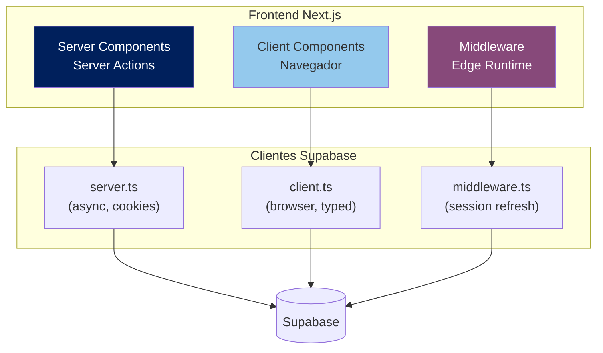

| Cliente | Archivo | Uso | Tipado |
|---|---|---|---|
| Server | `src/lib/supabase/server.ts` | Server Components, Server Actions | `any` (bypass insert friction) |
| Browser | `src/lib/supabase/client.ts` | Client Components | `Database` type |
| Middleware | `src/lib/supabase/middleware.ts` | Refresh de sesión | N/A |

### Componentes Principales

```
src/components/
├── chat/
│   ├── chat-provider.tsx      ← Context Provider (userId)
│   ├── chat-widget.tsx        ← Widget expandible, SSE streaming
│   └── chat-message.tsx       ← Renderizado markdown
├── prompt-card.tsx            ← Tarjeta de prompt con favoritos
├── video-card.tsx             ← Tarjeta de video con favoritos
├── main-nav.tsx               ← Navegación principal
├── mobile-nav.tsx             ← Menú responsivo móvil
├── home-search.tsx            ← Buscador en Home
├── search.tsx                 ← Input de búsqueda reutilizable
├── pagination.tsx             ← Paginación
├── vectorize-button.tsx       ← Botón de vectorización (admin)
├── confirm-delete.tsx         ← Modal de confirmación
├── viad-logo.tsx              ← Logo SVG "VIAD"
└── ui/                        ← 15 componentes shadcn/ui
    ├── button, input, textarea, label
    ├── card, badge, dialog, sheet
    ├── alert-dialog, select, checkbox
    ├── tabs, table, skeleton, sonner
```

### Server Actions

| Archivo | Funciones |
|---|---|
| `src/app/login/actions.ts` | `signIn`, `signUp` |
| `src/app/profile/actions.ts` | `updateProfile`, `toggleFavorite` |
| `src/app/admin/actions.ts` | CRUD prompts, CRUD videos |
| `src/app/admin/categories/actions.ts` | CRUD categorías |
| `src/app/admin/users/actions.ts` | `toggleBlockUser` |

---

## 4. Backend — agente_viad_hub

### Stack del Backend

| Capa | Tecnología | Versión |
|---|---|---|
| Framework Web | FastAPI | 0.128.3 |
| Orquestación IA | LangGraph | 1.0.9 |
| Integración LLM | LangChain | 1.2.10 |
| Modelo LLM | Google Gemini 3 Flash Preview | - |
| Embeddings | Google Gemini Embedding 001 | 3072 dims |
| Base de datos | Supabase (REST) | 2.27.3 |
| Streaming | sse-starlette | 2.2.1 |
| Servidor | Uvicorn (1 worker) | - |
| PDF | pdfplumber | - |
| Imágenes | Pillow | - |

### Arquitectura de Módulos

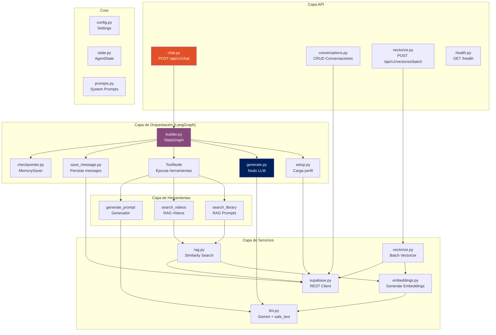

### Estado del Agente (AgentState)

```python
class AgentState(TypedDict):
    messages: list           # Lista de mensajes LangChain
    user_id: str             # ID del usuario
    conversation_id: str     # ID de la conversación
    user_name: str           # Nombre del perfil
    user_department: str     # Departamento del usuario
    is_first_message: bool   # Para lógica de saludo/título
    file_context: str        # Texto extraído de adjuntos
```

---

## 6. Flujo del Agente IA (LangGraph)

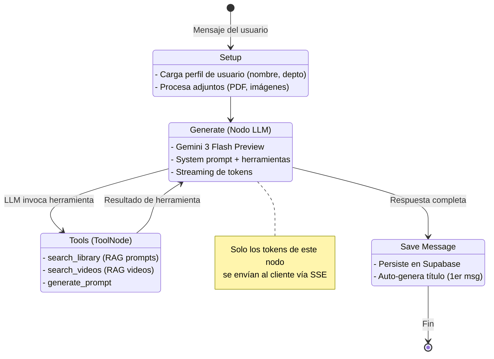

### Herramientas del Agente

| Herramienta | Función | Descripción |
|---|---|---|
| `search_library` | Búsqueda RAG en prompts | Busca por similitud semántica en embeddings de prompts. Retorna top 3 resultados con título, categoría, contenido y score. |
| `search_videos` | Búsqueda RAG en videos | Busca por similitud semántica en embeddings de videos. Retorna top 3 resultados con título, categoría, URL y score. |
| `generate_prompt` | Generador de prompts | Genera un prompt profesional usando Gemini. Recibe descripción de tarea, herramienta objetivo y departamento. |

### System Prompt

El agente VIAD Bot tiene un system prompt extenso que define:
- Personalidad y tono (asistente del CEO, español)
- Reglas de interacción y formato de respuestas
- Conocimiento institucional del CEO
- Reglas de uso de herramientas
- Reglas anti-duplicación de contenido
- Placeholders dinámicos: `{user_name}`, `{user_department}`

---

## 7. Pipeline RAG (Retrieval-Augmented Generation)

```mermaid
graph TB
    subgraph "1. Fase de Indexación (Admin)"
        A1[Admin sube prompt/video] --> A2[Click: Vectorizar]
        A2 --> A3[POST /api/v1/vectorize/batch]
        A3 --> A4[Gemini Embedding 001<br/>genera vector 3072d]
        A4 --> A5[Guarda en prompt_embeddings<br/>o video_embeddings]
        A5 --> A6[Marca vectorized=true]
    end

    subgraph "2. Fase de Consulta (Chat)"
        B1[Usuario pregunta algo] --> B2[LLM decide usar herramienta]
        B2 --> B3[search_library / search_videos]
        B3 --> B4[Genera embedding de la query]
        B4 --> B5[Supabase RPC:<br/>match_prompt_embeddings<br/>match_video_embeddings]
        B5 --> B6[pgvector: Similitud coseno<br/>Top 3 resultados]
        B6 --> B7[Resultados inyectados<br/>en contexto del LLM]
        B7 --> B8[LLM genera respuesta<br/>enriquecida con datos reales]
    end

    style A2 fill:#e25027,color:#fff
    style B5 fill:#3ecf8e,color:#fff
    style B8 fill:#00205c,color:#fff
```

### Funciones RPC de Similitud (Supabase)

```sql
-- match_prompt_embeddings(query_embedding, match_threshold, match_count)
-- match_video_embeddings(query_embedding, match_threshold, match_count)

-- Retorna: id, content, metadata, similarity
-- Usa: operador <=> (cosine distance) en columna VECTOR(3072)
```

---

## 8. Flujo de Autenticación y Autorización

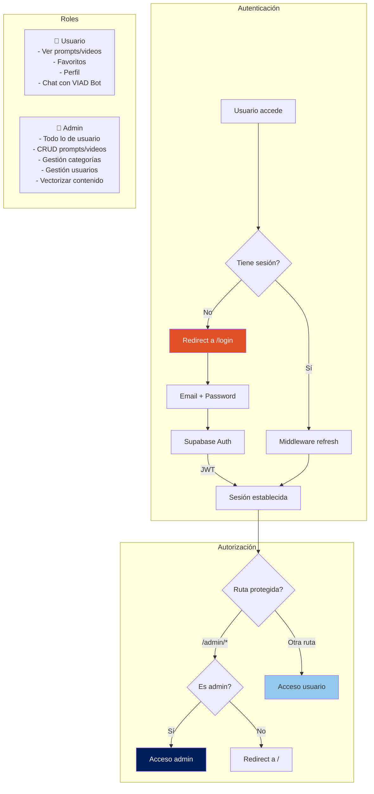

### Middleware de Sesión

```
Petición HTTP
    ↓
middleware.ts (Edge Runtime)
    ├── Rutas excluidas: /login, /auth/*, assets estáticos
    ├── updateSession() → refresca JWT si está por expirar
    └── Redirige a /login si no hay sesión válida
    ↓
App Router (Next.js)
    ├── admin/layout.tsx → verifica profiles.is_admin
    └── Renderiza página protegida
```

---

## 9. Streaming SSE (Server-Sent Events)

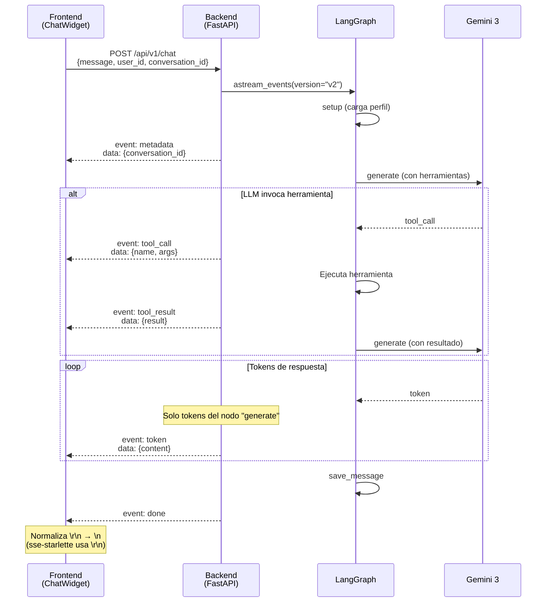

### Eventos SSE

| Evento | Datos | Descripción |
|---|---|---|
| `metadata` | `{conversation_id}` | ID de conversación (nueva o existente) |
| `token` | `{content}` | Token individual de la respuesta |
| `tool_call` | `{name, args}` | El LLM invocó una herramienta |
| `tool_result` | `{result}` | Resultado de la herramienta ejecutada |
| `error` | `{message}` | Error durante el procesamiento |
| `done` | `{}` | Fin del streaming |

**Filtrado crítico:** Solo se transmiten al cliente los tokens del nodo `generate`. Los tokens de `save_message` (generación de título) y herramientas (`generate_prompt`) se filtran verificando `event.metadata.langgraph_node`.

---

## 10. Estructura de Archivos

### Backend (`agente_viad_hub/`)

```
agente_viad_hub/
├── main.py                           # Entry point FastAPI
├── requirements.txt                  # Dependencias Python
├── runtime.txt                       # Python 3.13
├── railway.json                      # Config Railway
├── Procfile                          # Comando de inicio
├── .env.example                      # Template variables
│
└── app/
    ├── api/                          # Rutas HTTP
    │   ├── chat.py                   # POST /api/v1/chat (SSE)
    │   ├── conversations.py          # CRUD conversaciones
    │   ├── vectorize.py              # Vectorización batch
    │   └── health.py                 # Health check
    │
    ├── core/                         # Configuración central
    │   ├── config.py                 # Settings (env vars)
    │   ├── state.py                  # AgentState TypedDict
    │   └── prompts.py                # System prompts
    │
    ├── graph/                        # Orquestación LangGraph
    │   ├── builder.py                # StateGraph + edges
    │   ├── checkpointer.py           # MemorySaver
    │   └── nodes/
    │       ├── setup.py              # Carga perfil + adjuntos
    │       ├── generate.py           # Nodo LLM principal
    │       └── save_message.py       # Persistencia + título
    │
    ├── tools/                        # Herramientas del agente
    │   ├── search_library.py         # RAG búsqueda prompts
    │   ├── search_videos.py          # RAG búsqueda videos
    │   └── generate_prompt.py        # Generador de prompts
    │
    ├── services/                     # Lógica de negocio
    │   ├── llm.py                    # Singleton LLM + safe_text()
    │   ├── supabase.py               # Cliente REST Supabase
    │   ├── rag.py                    # Búsqueda por similitud
    │   ├── embeddings.py             # Generación de embeddings
    │   └── vectorize.py              # Vectorización batch
    │
    └── schemas/                      # Modelos Pydantic
        ├── chat.py                   # ChatRequest, StreamEvent
        ├── conversation.py           # Conversation, Message
        └── vectorize.py              # VectorizeRequest
```

### Frontend (`ceo_ia_hub/src/`)

```
ceo_ia_hub/
├── next.config.ts                    # Config Next.js
├── tailwind.config.ts                # Tailwind v4
├── components.json                   # shadcn/ui registry
├── package.json                      # Dependencias
│
├── public/
│   └── consorcio-banner.png          # Banner institucional
│
├── supabase/migrations/              # 12 migraciones SQL
│   ├── 01_update_category_text.sql
│   ├── ...
│   └── 12_update_vector_dimensions_3072.sql
│
└── src/
    ├── middleware.ts                  # Auth middleware
    │
    ├── app/                          # App Router
    │   ├── layout.tsx                # Root layout + ChatProvider
    │   ├── page.tsx                  # Home
    │   ├── icon.tsx                  # Favicon dinámico
    │   ├── globals.css               # Estilos globales + variables
    │   ├── fonts/                    # Monda, Nexa (local)
    │   │
    │   ├── login/
    │   │   ├── page.tsx              # Formulario login/signup
    │   │   └── actions.ts            # signIn, signUp
    │   │
    │   ├── auth/                     # Callbacks de auth
    │   │   ├── callback/
    │   │   ├── reset-password/
    │   │   ├── signout/
    │   │   └── update-password/
    │   │
    │   ├── library/                  # Catálogo de prompts
    │   │   ├── page.tsx
    │   │   └── loading.tsx
    │   │
    │   ├── learning/                 # Catálogo de videos
    │   │   ├── page.tsx
    │   │   └── loading.tsx
    │   │
    │   ├── search/                   # Búsqueda global
    │   │   └── page.tsx
    │   │
    │   ├── profile/                  # Perfil de usuario
    │   │   ├── page.tsx
    │   │   └── actions.ts
    │   │
    │   └── admin/                    # Panel admin
    │       ├── layout.tsx            # Guard admin
    │       ├── page.tsx              # Dashboard + stats
    │       ├── actions.ts            # CRUD prompts/videos
    │       ├── prompts/              # Gestión prompts
    │       │   ├── page.tsx
    │       │   ├── new/page.tsx
    │       │   └── [id]/edit/page.tsx
    │       ├── videos/               # Gestión videos
    │       │   ├── page.tsx
    │       │   ├── new/page.tsx
    │       │   └── [id]/edit/page.tsx
    │       ├── categories/           # Gestión categorías
    │       │   ├── page.tsx
    │       │   └── actions.ts
    │       └── users/                # Gestión usuarios
    │           ├── page.tsx
    │           ├── actions.ts
    │           └── toggle-block-button.tsx
    │
    ├── components/                   # Componentes reutilizables
    │   ├── chat/
    │   │   ├── chat-provider.tsx
    │   │   ├── chat-widget.tsx
    │   │   └── chat-message.tsx
    │   ├── prompt-card.tsx
    │   ├── video-card.tsx
    │   ├── main-nav.tsx
    │   ├── mobile-nav.tsx
    │   ├── pagination.tsx
    │   ├── viad-logo.tsx
    │   ├── vectorize-button.tsx
    │   └── ui/                       # 15 componentes shadcn/ui
    │
    ├── lib/
    │   ├── constants.ts              # Contenido estático
    │   ├── utils.ts                  # cn() utility
    │   └── supabase/
    │       ├── server.ts             # Cliente servidor
    │       ├── client.ts             # Cliente navegador
    │       └── middleware.ts         # Cliente middleware
    │
    └── types/
        └── database.types.ts         # Tipos auto-generados
```

---

## 11. Rutas y Endpoints de la API

### Backend API (FastAPI)

| Método | Ruta | Descripción | Autenticación |
|---|---|---|---|
| `GET` | `/health` | Health check | Ninguna |
| `POST` | `/api/v1/chat` | Chat streaming (SSE) | user_id en body |
| `GET` | `/api/v1/conversations` | Listar conversaciones del usuario | query param user_id |
| `GET` | `/api/v1/conversations/{id}/messages` | Obtener mensajes de conversación | - |
| `POST` | `/api/v1/conversations` | Crear nueva conversación | user_id en body |
| `PATCH` | `/api/v1/conversations/{id}` | Actualizar título | - |
| `DELETE` | `/api/v1/conversations/{id}` | Eliminar conversación (cascade) | - |
| `POST` | `/api/v1/vectorize/batch` | Vectorizar todos los prompts y videos | - |

### Frontend Routes (Next.js App Router)

| Ruta | Protección | Descripción |
|---|---|---|
| `/` | Autenticado | Home — Logo, banner institucional, botones CTA |
| `/login` | Pública | Login y registro (email/password) |
| `/auth/*` | Pública | Callbacks de OAuth, reset password |
| `/library` | Autenticado | Catálogo de prompts (búsqueda, filtros, favoritos, paginación) |
| `/learning` | Autenticado | Catálogo de videos (búsqueda, filtros, favoritos, paginación) |
| `/search` | Autenticado | Búsqueda global (prompts + videos en paralelo) |
| `/profile` | Autenticado | Perfil: editar nombre/departamento, ver favoritos |
| `/admin` | Solo Admin | Dashboard con estadísticas |
| `/admin/prompts` | Solo Admin | CRUD prompts + botón vectorizar |
| `/admin/videos` | Solo Admin | CRUD videos |
| `/admin/categories` | Solo Admin | CRUD categorías dinámicas |
| `/admin/users` | Solo Admin | Gestión usuarios (bloquear/desbloquear) |

### CORS Backend

```
Orígenes permitidos:
  - https://ceo-ia-hub-tu7s.vercel.app    (producción)
  - http://localhost:3000                   (desarrollo)
  - https://*.vercel.app                    (previews, via regex)
  - Orígenes extra via env CORS_ORIGINS     (comma-separated)
```

---

## 12. Modelo de Datos

### Diagrama Entidad-Relación

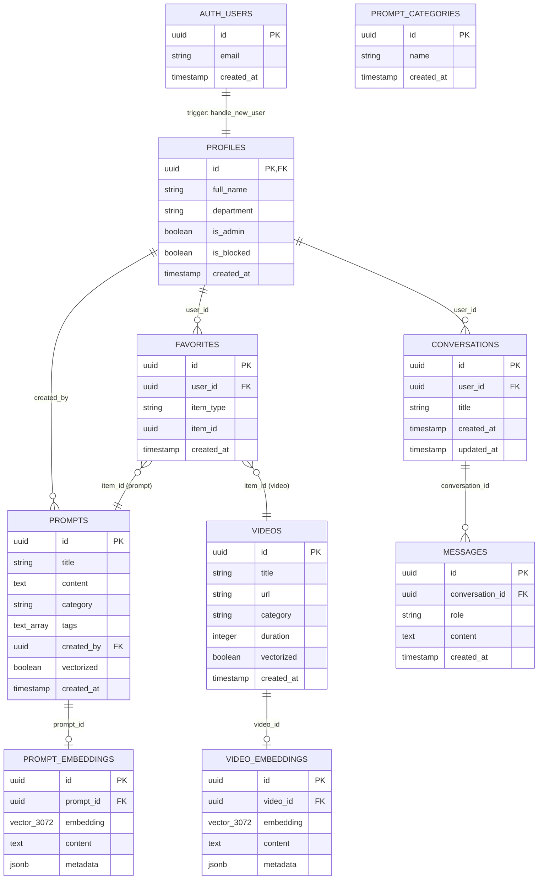

### Políticas RLS (Row Level Security)

```
Patrón general:
  - SELECT: usuarios autenticados pueden leer
  - INSERT/UPDATE/DELETE: solo admins (profiles.is_admin = true)

Excepciones:
  - favorites: INSERT/DELETE para el propio user_id
  - profiles: UPDATE solo del propio registro
  - conversations/messages: CRUD solo para el propio user_id
```

### Migraciones SQL

| # | Archivo | Descripción |
|---|---|---|
| 01 | `update_category_text.sql` | Categorías de prompts a tipo text |
| 02 | `create_categories_table.sql` | Tabla de categorías dinámicas |
| 03 | `update_video_category_text.sql` | Categorías de videos a tipo text |
| 04 | `add_user_blocked_field.sql` | Campo `is_blocked` en profiles |
| 05 | `fix_user_blocked_and_admin_policy.sql` | Fix idempotente + política admin UPDATE |
| 06 | `create_favorites_table.sql` | Tabla favorites con RLS |
| 07 | `create_conversations_and_messages.sql` | Tablas para chat (conversaciones + mensajes) |
| 08 | `create_prompt_embeddings.sql` | Embeddings vectoriales para prompts |
| 09 | `create_video_embeddings.sql` | Embeddings vectoriales para videos |
| 10 | `add_vectorized_flag.sql` | Flag `vectorized` en prompts/videos |
| 11 | `rpc_similarity_search.sql` | Funciones RPC para búsqueda por similitud |
| 12 | `update_vector_dimensions_3072.sql` | Actualización de vectores de 768 a 3072 dimensiones |

---

## 13. Despliegue e Infraestructura

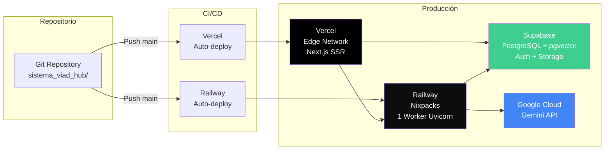

### Configuración de Despliegue

#### Frontend (Vercel)

| Campo | Valor |
|---|---|
| Framework | Next.js (auto-detectado) |
| Build | `npm run build` |
| Output | `.next/` |
| Node.js | 18+ |
| Deploy trigger | Push a `main` |
| Preview deploys | Automáticos por PR |

#### Backend (Railway)

| Campo | Valor |
|---|---|
| Builder | Nixpacks |
| Runtime | Python 3.13 |
| Start | `uvicorn main:app --host 0.0.0.0 --port $PORT --workers 1` |
| Health check | `GET /health` (30s timeout) |
| Restart policy | ON_FAILURE, max 5 retries |
| Deploy trigger | Push a `main` |
| Workers | **1 (obligatorio)** — MemorySaver es per-process |

---

## 14. Variables de Entorno

### Frontend (`ceo_ia_hub/.env.local`)

| Variable | Descripción | Ejemplo |
|---|---|---|
| `NEXT_PUBLIC_SUPABASE_URL` | URL del proyecto Supabase | `https://xxx.supabase.co` |
| `NEXT_PUBLIC_SUPABASE_ANON_KEY` | Clave anónima de Supabase | `eyJ...` |
| `NEXT_PUBLIC_VIAD_BOT_API_URL` | URL del backend en Railway | `https://web-production-ccc6a.up.railway.app` |

### Backend (`agente_viad_hub/.env`)

| Variable | Descripción | Requerida |
|---|---|---|
| `GOOGLE_API_KEY` | API key de Google Gemini | Sí |
| `SUPABASE_URL` | URL del proyecto Supabase | Sí |
| `SUPABASE_SERVICE_ROLE_KEY` | Clave de servicio (bypass RLS) | Sí |
| `SUPABASE_DB_URL` | URL PostgreSQL directa (no usada actualmente) | No |
| `CORS_ORIGINS` | Orígenes adicionales permitidos (comma-separated) | No |

---

## 15. Stack Tecnológico

```mermaid
graph TB
    subgraph "Frontend"
        NEXT[Next.js 16]
        REACT[React 19]
        TS[TypeScript]
        TAILWIND[Tailwind CSS v4]
        SHADCN[shadcn/ui]
        LUCIDE[lucide-react]
    end

    subgraph "Backend"
        FASTAPI[FastAPI 0.128]
        LANGGRAPH[LangGraph 1.0]
        LANGCHAIN[LangChain 1.2]
        SSE[sse-starlette]
        UVICORN[Uvicorn]
    end

    subgraph "IA / ML"
        GEMINI3[Gemini 3 Flash<br/>Preview]
        GEMINI_EMB[Gemini Embedding<br/>001 (3072d)]
    end

    subgraph "Base de Datos"
        POSTGRES[PostgreSQL]
        PGVECTOR[pgvector]
        SUPA_AUTH[Supabase Auth]
        SUPA_RLS[Row Level Security]
    end

    subgraph "Infraestructura"
        VERCEL_I[Vercel]
        RAILWAY_I[Railway]
        SUPABASE_I[Supabase Cloud]
    end

    NEXT --> REACT
    REACT --> TS
    TS --> TAILWIND
    TAILWIND --> SHADCN
    FASTAPI --> LANGGRAPH
    LANGGRAPH --> LANGCHAIN
    LANGCHAIN --> GEMINI3
    LANGCHAIN --> GEMINI_EMB
    POSTGRES --> PGVECTOR

    style NEXT fill:#00205c,color:#fff
    style FASTAPI fill:#e25027,color:#fff
    style GEMINI3 fill:#4285F4,color:#fff
    style POSTGRES fill:#3ecf8e,color:#fff
```

### Resumen Completo

| Capa | Tecnología | Versión |
|---|---|---|
| **Frontend Framework** | Next.js (App Router) | 16 |
| **UI Library** | React | 19 |
| **Lenguaje Frontend** | TypeScript | Strict |
| **Estilos** | Tailwind CSS | v4 |
| **Componentes UI** | shadcn/ui | new-york |
| **Backend Framework** | FastAPI | 0.128.3 |
| **Orquestación IA** | LangGraph | 1.0.9 |
| **LLM Integration** | LangChain | 1.2.10 |
| **LLM Provider** | langchain-google-genai | 4.2.1 |
| **Modelo LLM** | Google Gemini 3 Flash Preview | - |
| **Modelo Embeddings** | Google Gemini Embedding 001 | 3072 dims |
| **Base de Datos** | Supabase PostgreSQL + pgvector | - |
| **Auth** | Supabase Auth | Email/password |
| **Streaming** | sse-starlette | 2.2.1 |
| **Deploy Frontend** | Vercel | - |
| **Deploy Backend** | Railway | Nixpacks |

---

## 16. Restricciones Técnicas

### Limitaciones Conocidas

| Restricción | Razón | Solución Actual |
|---|---|---|
| **1 worker en Railway** | MemorySaver es per-process; múltiples workers pierden contexto de conversación | `--workers 1` obligatorio |
| **Supabase solo REST** | Conexión PostgreSQL directa falla por incompatibilidad IPv4/IPv6 + SSL entre Railway y Supabase Session Pooler | Cliente REST con service role key |
| **Gemini temp=1.0** | Gemini 3 Flash Preview requiere `temperature=1.0` obligatoriamente | Configurado en singleton LLM |
| **convert_system_message** | Gemini requiere `convert_system_message_to_human=True` | Configurado en singleton LLM |
| **Content como list[dict]** | Gemini retorna contenido como `list[dict]` en vez de `str` | Función `safe_text()` para normalizar |
| **SSE line endings** | sse-starlette usa `\r\n` en vez de `\n` estándar | Frontend normaliza `\r\n` → `\n` antes de parsear |
| **Vectores 3072 dims** | Gemini Embedding 001 genera vectores de 3072 dimensiones | Columnas `VECTOR(3072)` en pgvector |

---

## Apéndice: Diagrama de Contexto del Sistema

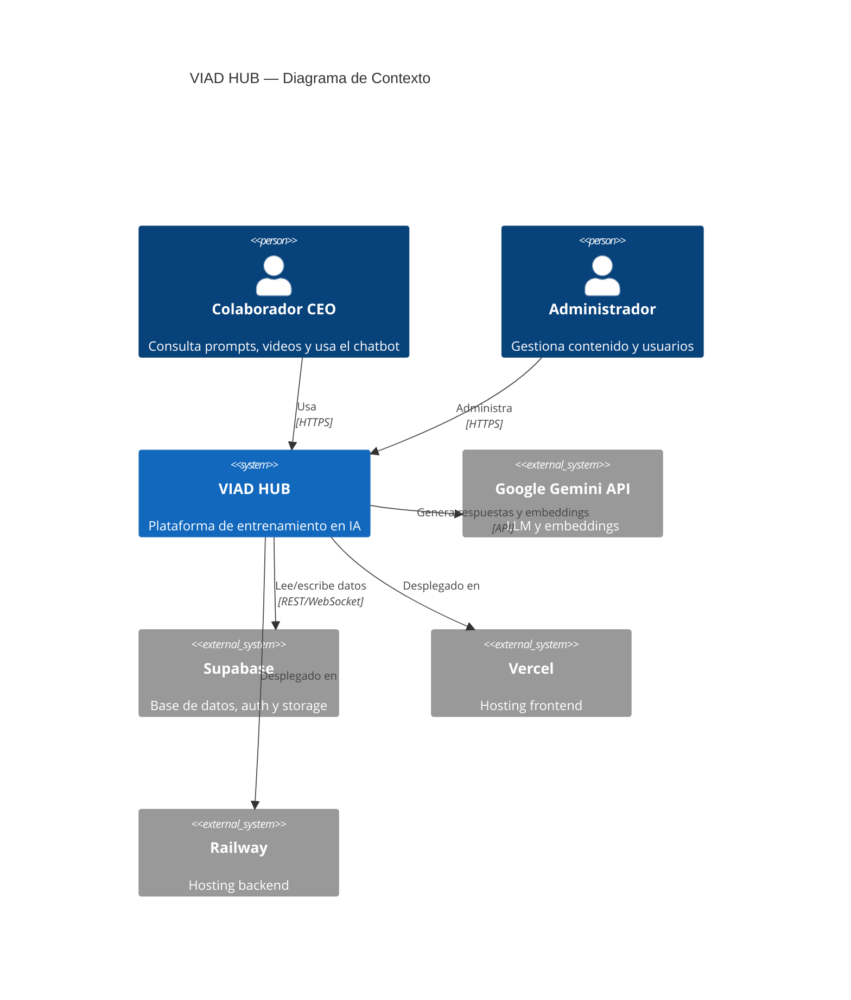

---

> **Nota:** Los diagramas Mermaid de este documento se renderizan automáticamente en GitHub, VS Code (con extensión), y la mayoría de visualizadores Markdown modernos.

---

*Documento generado el 9 de marzo de 2026*
*VIAD HUB — Consorcio Educativo de Oriente*
